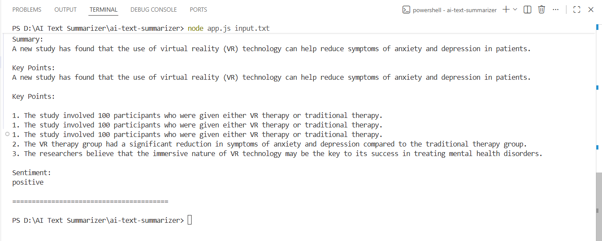

# AI Text Summarizer CLI

A simple command-line tool that converts unstructured text into structured summaries using an LLM.


## Setup

1. Clone the repository:
```bash
git clone https://github.com/YOUR_USERNAME/ai-text-summarizer.git
cd ai-text-summarizer

2. Install dependencies:
npm install

3. Create a .env file:
cp .env.example .env

4. Add your API key in .env:
GROQ_API_KEY=your_api_key_here

## Using a file:
node app.js input.txt

## Using stdin:
echo "Your text here" | node app.js

## Example Output

================ RESULT ================

Summary:
Artificial Intelligence is transforming industries by improving efficiency and automation.

Key Points:
1. AI automates repetitive tasks
2. Improves decision-making
3. Used across multiple industries

Sentiment:
positive

========================================

## LLM API Used:
Used Groq API (LLaMA 3.3 model).

## Why Groq?
Free to use (no billing required).
Fast inference.
Compatible with OpenAI-style API.
Good performance for structured text generation.

## A brief explanation of your prompt design. why did you write it the way you did?
The prompt was designed to Enforce a strict JSON structure, Clearly define required fields (summary, key points, sentiment), Minimize ambiguity for the model.

Techniques used: Explicit JSON schema in prompt, System + user role separation, Temperature set to 0 for deterministic output, Instructions like “Return ONLY valid JSON”.

## Improvements (With More Time)
If I had more time, I would focus on improving reliability, usability, and extensibility:

- **Retry & Validation Layer**  
  Add automatic retries and strict JSON schema validation (e.g., using `zod` or `ajv`) to handle malformed LLM responses more robustly.

- **Batch Processing Support**  
  Allow users to process multiple files at once and export results in structured formats like JSON/CSV.

- **Configurable Output Schema**  
  Enable users to customize output fields (e.g., number of key points, tone, or additional metadata) via CLI flags or a config file.

- **Confidence / Quality Indicator**  
  Provide a confidence score or flag potentially unreliable outputs based on response consistency.

- **Improved CLI Experience**  
  Add better CLI UX with argument parsing (`commander`), help commands, and colored output for readability.

- **Web Interface (Optional UI)**  
  Build a minimal web UI to input text and visualize structured output interactively.

- **Streaming & Performance Optimization**  
  Use streaming responses for faster feedback and improve handling of large inputs.

- **Testing & Error Handling**  
  Add unit tests and more granular error handling for production readiness.

## Trade-offs & Shortcuts
Relied on prompt engineering instead of strict schema validation.
No retry mechanism for API failures.
Minimal CLI UX (focused on core functionality).
Did not implement advanced logging or testing due to time constraints.

## Screenshot:


##Deployed Link:
https://huggingface.co/spaces/atulvatsvatsal/ai-text-summarizer
